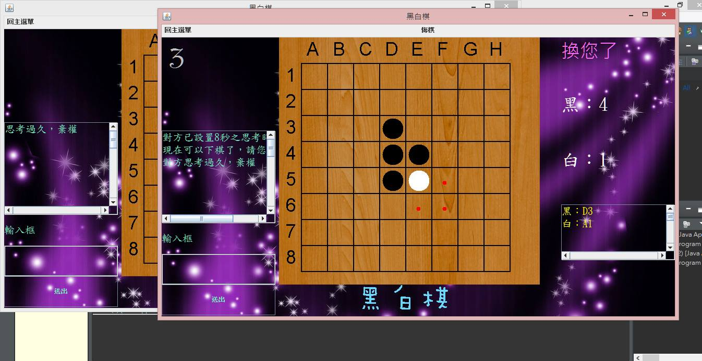

# Introduction_to_Programming_Lab
an exchange program in summer 2016

## Topic
黑白棋

## Demo Graph

## Requirement
* 本機兩人對戰
* 網路對戰(Socket)
* 可增加聊天功能

## Classes I used
* FinalProj：統整本機兩人對戰與網路對戰的功能，顯示主選單。
* Single：實現本機兩人對戰的功能。
* getBoard：負責繪製每次棋盤刷新，重寫了paintComponent函數。
* Limit：單機的TimerTask，實現倒數與超時換邊的功能。
* WithWeb：繼承Single類，實現網路對戰的功能。
* goThread：建構連線對戰的圖形用戶介面。
* WebLimit：連線對戰的TimerTask，與Limit類的功能相似。

